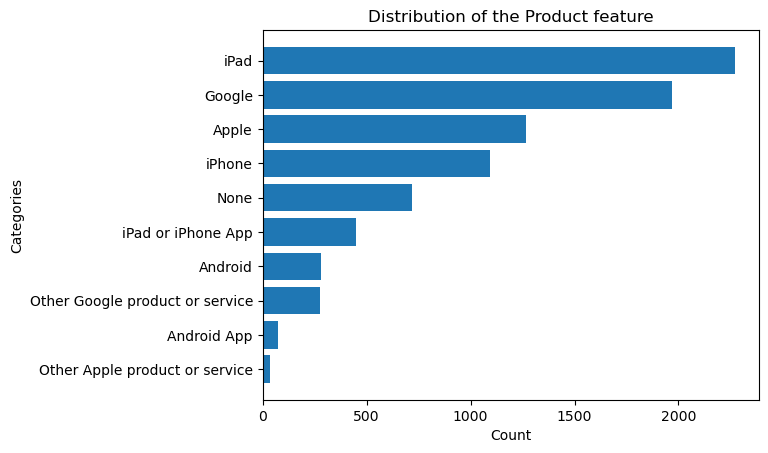
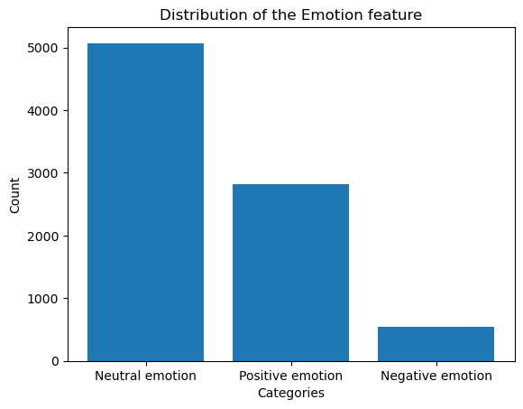
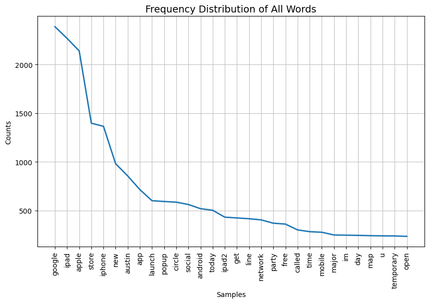
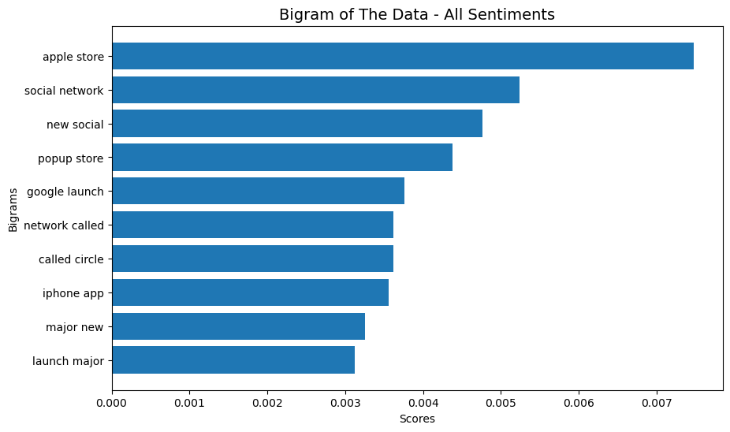
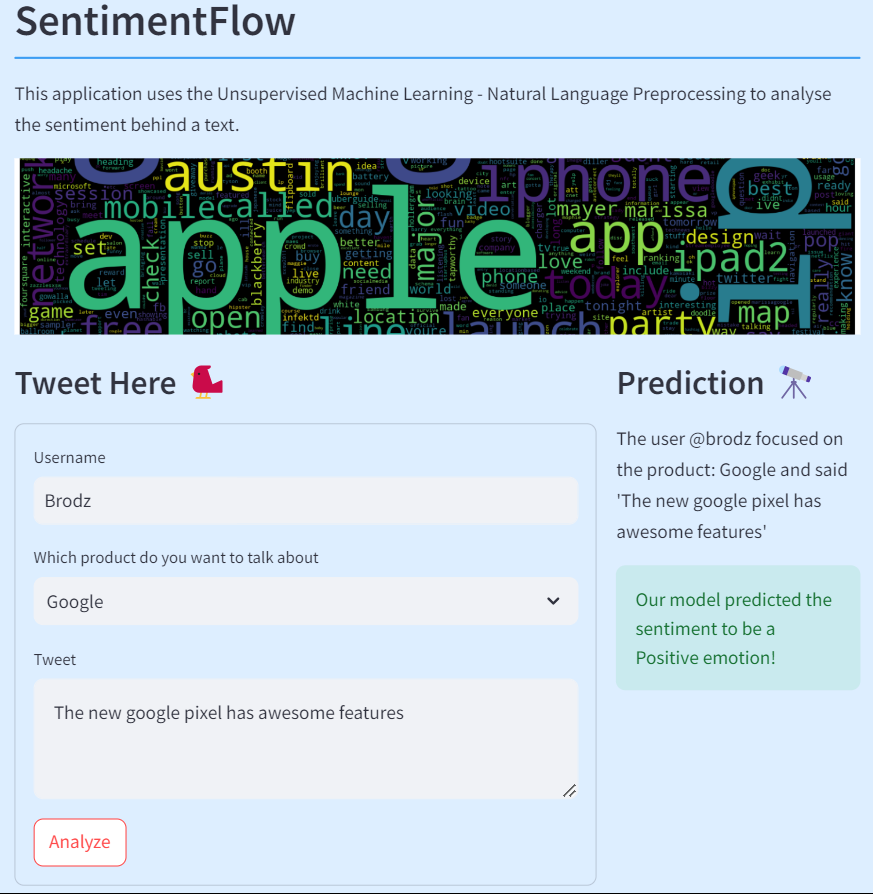

# SentimentFlow: Twitter Sentiment Analysis

  

## Overview

SentimentFlow addresses the challenge of understanding public sentiment toward products on Twitter. Stakeholders, including companies, marketing teams, and decision-makers, seek insights to make informed strategic decisions based on social media sentiment.

## Problem Statement

The goal is to accurately classify tweet sentiments as positive, negative, or neutral. This classification helps companies gauge customer satisfaction and tailor responses accordingly.

## Stakeholders

1. **Companies (Apple and Google):** Monitor product perception and identify areas for improvement.
2. **Marketing Teams:** Adjust campaigns based on sentiment analysis.
3. **Decision-Makers:** Use insights for product development and brand reputation.

## Value Proposition

Accurate sentiment classification provides actionable insights:
- Negative sentiment: Prompt issue resolution.
- Positive sentiment: Reinforce successful strategies.
- Neutral sentiment: Contextual understanding.

## Objectives

**Main Objective:**
Develop an NLP multiclass classification model with:
- Recall score ≥ 80%
- Accuracy ≥ 80%
- Three sentiment classes: Positive, Negative, and Neutral.

**Specific Objectives:**
1. Identify common words using Word Cloud.
2. Confirm positive and negative word associations.
3. Recognize mentioned products.
4. Analyze sentiment distribution.

## **Data Analysis**

***1. Product Distribution***

***2. Distribution of the `emotion` feature***

  

    

> It is evident that class imbalance exists in the data.

***3. Frequency Distribution of words used in tweets***
    

    
***4. Top 10 Bigrams***

    

    

***5. Word Cloud Visual***

Shows the most frequent words used in tweets; those with the highest frequency are larger in size.

    

    

## **Data Modeling**

### ***Models***

The machine learning algorithms used in this section are:

- RandomForest
- Naive Bayes(MultinomialNB)
- LogisticRegression
- DecisionTrees

> The data was vectorized using both `CountVectorizer` and `TfidfVectorizer` to see which vectorizer performed better.

> The best performing models were `RandomForestClassifier` & `LogisticRegression`

### ***1. Random Forest Classifier***

*Before tuning*

    Count Vectorisation Results
    
    Main Metrics
    ------------
    Accuracy Score 0.499
    Recall Score 0.502
    
    Classification Report
                  precision    recall  f1-score   support
    
               0       0.91      0.18      0.30      1541
               1       0.74      0.45      0.56      1523
               2       0.39      0.88      0.54      1500
    
        accuracy                           0.50      4564
       macro avg       0.68      0.50      0.47      4564
    weighted avg       0.68      0.50      0.47      4564
    
    ---------
    TFIDF Vectorisation Results
    
    Main Metrics
    ------------
    Accuracy Score 0.71
    Recall Score 0.71
    
    Classification Report
                  precision    recall  f1-score   support
    
               0       0.98      0.81      0.89      1541
               1       0.74      0.44      0.55      1523
               2       0.56      0.89      0.68      1500
    
        accuracy                           0.71      4564
       macro avg       0.76      0.71      0.71      4564
    weighted avg       0.76      0.71      0.71      4564

*After hyper-parameter tuning*

    Count Vectorisation Results
    
    Best Random Forest Model (Count Vectorization):
     RandomForestClassifier(n_estimators=200, random_state=42)
    
    Test Accuracy (Count Vectorization): 0.704
    
    Test Recall (Count Vectorization): 0.703
    ---------
    
    
    TFIDF Vectorisation Results
    
    Best Random Forest Model (TFIDF Vectorization):
     RandomForestClassifier(n_estimators=200, random_state=42)
    
    Test Accuracy (TFIDF Vectorization): 0.837
    
    Test Recall (TFIDF Vectorization): 0.836
    

#### *Observation*

> The significant improvement in test accuracy from 0.50 to 0.70 in the model using Count Vectorization.

> Note the improvement from 0.71 to 0.837 for the model using TF-IDF Vectorization

> We can note an indication that TF-IDF provides a superior feature representation for the Random Forest model.

### ***2. Logistic Regression***

*Before tuning*

    Count Vectorisation Results
    
    Main Metrics
    ------------
    Accuracy Score 0.696
    Recall Score 0.695
    
    Classification Report
                  precision    recall  f1-score   support
    
               0       0.73      0.91      0.81      1541
               1       0.71      0.65      0.68      1523
               2       0.64      0.53      0.58      1500
    
        accuracy                           0.70      4564
       macro avg       0.69      0.69      0.69      4564
    weighted avg       0.69      0.70      0.69      4564
    
    ---------
    TFIDF Vectorisation Results
    
    Main Metrics
    ------------
    Accuracy Score 0.808
    Recall Score 0.807
    
    Classification Report
                  precision    recall  f1-score   support
    
               0       0.91      0.97      0.94      1541
               1       0.73      0.74      0.74      1523
               2       0.77      0.71      0.74      1500
    
        accuracy                           0.81      4564
       macro avg       0.80      0.81      0.80      4564
    weighted avg       0.81      0.81      0.81      4564

*After hyper-parameter tuning*

    Count Vectorisation Results
    
    Best Logistic Regression Model (Count Vectorization):
     LogisticRegression(C=30.0)
    
    Test Accuracy (Count Vectorization): 0.704
    
    Test Recall (Count Vectorization): 0.702
    ---------
    
    
    TFIDF Vectorisation Results
    
    Best Logistic Regression Model (TFIDF Vectorization):
     LogisticRegression(C=31.0, max_iter=200)
    
    Test Accuracy (TFIDF Vectorization): 0.835
    
    Test Recall (TFIDF Vectorization): 0.834
    

#### *Observation*

> The significant improvement in test accuracy from 0.70 to 0.83 in the Count Vectorization based model.

> TF-IDF Vectorization-based model improved from 0.808 to 0.831.

> Further indication that the TFIDF vectorisation is better

## **Conclusion**

We explored the effectiveness of various machine learning models to predict the sentiment of tweets about Apple and Google products. Our data was preprocessed by label encoding the emotion labels, applying SMOTE to address class imbalance, and vectorizing the text data using both CountVectorizer and TF-IDF. 
We evaluated the performance of the models based on the key metrics; accuracy and recall and investigated the different models including RandomForest, Naive Bayes (MultinomialNB), Logistic Regression, and Decision Trees. We further conducted hyperparameter tuning to optimize their performance.

> The best model was found to be Random Forest Classifier & Logistic Regression.

## **Recommendations**

Based on the findings, here are some recommendations for future work and practical application:

**i.) Monitoring Negative Sentiments:** 

Implement real-time monitoring and alert systems to flag negative sentiments as they arise. This allows for prompt intervention and resolution of customer issues.

**ii.) Scalability:** 

Assess the scalability of the models for handling large-scale data in a production environment. Optimize the models for performance and efficiency to ensure they can process a high volume of tweets quickly and accurately.

**iii.) Real-Time Processing:** 

Explore real-time processing capabilities to provide up-to-date sentiment analysis, which is crucial for timely decision-making and responding to emerging trends.

**iv.) Continuous Model Monitoring:**

Implement continuous monitoring of the deployed models to detect any performance degradation over time. Retrain the models if necessary with new data to maintain accuracy and relevance.

**v.) Integration with Social Media Platforms:**

Integrate the sentiment analysis models with social media platforms' APIs for seamless data collection and analysis, enabling continuous monitoring and real-time insights.

## **Deployment**

The app was deployed using Streamlit.

**View this project [here.](https://sentimentflow-nlp-project.streamlit.app/)** 👈

## **Example Usage**

## **Installation**

Clone the repository: bash `git clone https://github.com/Misfit911/SentimentFlow`

Install dependencies: bash `pip install -r requirements.txt`

## **Usage**

To run the app engine: bash `python app.py`

## **License**

This project is licensed under the Creative Commons Zero v1.0 Universal - see the LICENSE file for details.
